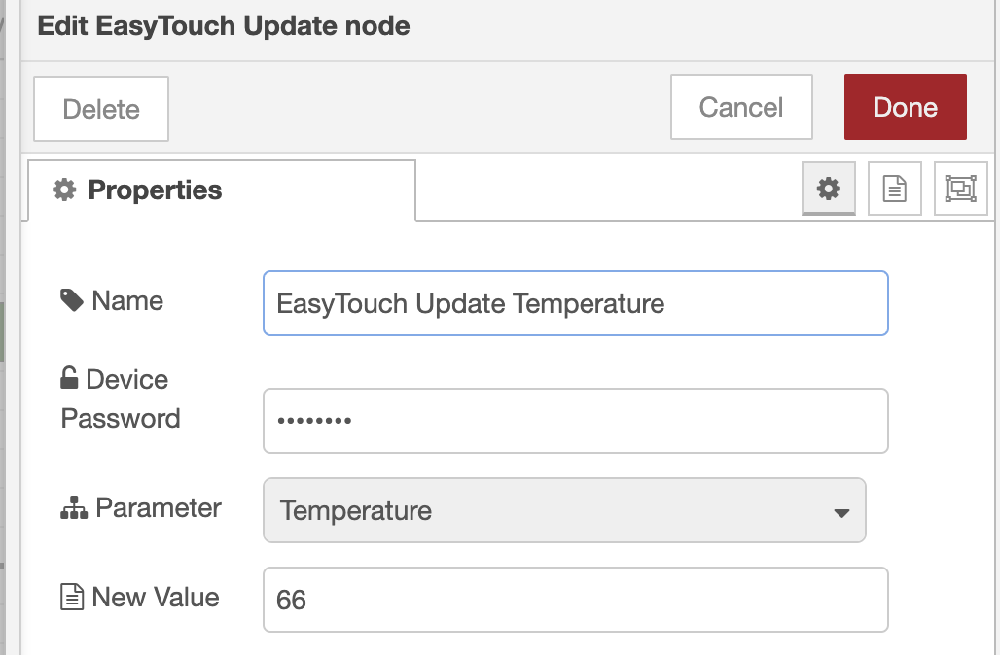

# node-red-contrib-easytouch-ble is a simple NPM package (and NodeRED wrapper) for EasyTouch RV thermostats

---

# Getting Started

## Prerequisites

* [Node.js](https://nodejs.org/en/) v18.0.0 or newer
* [Node-RED](https://nodered.org) v3.0.0 or newer

## Installation

### Install via Node-RED Manage Palette

1. `python3`, `make`, and `g++` are required for this package to build. For HAOS, go to the Node-RED Add-on Configuration tab and add `python3`, `make`, and `g++` to the `system_packages` and restart Node-RED Add-on before installing the node through Manage Pallete.


2. Navigate to the Node-RED Manage Pallette Install tab and add

`@k3vmcd/node-red-contrib-easytouch-ble`

### Install via npm

```
$ cd ~/.node-red
$ npm install @k3vmcd/node-red-contrib-easytouch-ble
# then restart node-red
```

---

# Example Usage

### Changing the thermostat temperature



**Note: The password is the thermostat's user account password. This password is sent directly to the device using Bluetooth (never sent over HTTPS).**
